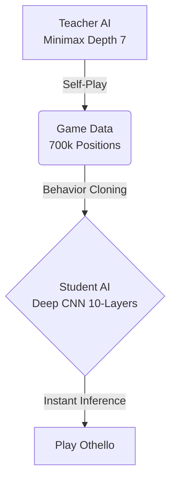
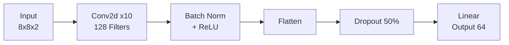

# 誤差逆伝播法による学習手法および行動クローニングへの応用


## 📖 概要 (Overview)
このリポジトリは、行動クローニング (Behavior Cloning)を用いて学習したオセロAIの実装です。
深さ7のMinimax探索を行う強力な教師AIから生成された約70万局面の棋譜データを学習し、探索を行わずに瞬時に着手決定を行う10層のCNNモデルを構築しました。


本プロジェクトは、愛媛大学理学部理学科数学数理情報コースの特別研究として実施されたものです。

## 🎥 デモ (Demo)
学習済みAI (黒) vs Minimax Depth 3 (白) の対戦ダイジェストです。（※7倍速再生）


## ✨ 特徴 (Features)

### 🧠 1. Deep CNN Architecture
Deep CNN Architecture: VGGNetの設計思想を取り入れた、10層の畳み込みニューラルネットワーク(CNN)を構築しました。

入力: 盤面を(2, 8, 8)のグリッド(自石・他石チャンネル)として扱います。

構造: 3x3の小さな畳み込みフィルタを積み重ねることで、盤面の局所的なパターンから大局的な戦略まで、空間的な特徴(Spatial Features)を効果的に抽出します。

工夫: Batch NormalizationとReLUによる学習の安定化に加え、全結合層へのDropout(50%)とEarly Stopping(Patience=10)の導入により、過学習を抑制し未知の局面への対応力を高めました。





### ⚡ 2. 高いスピードとパフォーマンス
探索を行わない「直感型」AIでありながら、Minimax法 (Depth 3)に対して勝率 65%を記録しました。
-知識の蒸留: 深く読む教師AI（Depth 7）の思考プロセスをモデルに学習させることで、本来なら膨大な計算が必要な「読み」を、高速な行列演算に置き換えることに成功しました。
-推論速度: 探索木を展開しないため、着手にかかる時間は0.01秒以下です。

### 📚 3. 高品質なデータセット生成
学習の質を左右する教師データ生成には、以下の工夫を凝らしています。
-強力な教師:Alpha-Beta法を用いたMinimax探索 (Depth 7)に、位置重み付け（四隅の確保など）を加えた評価関数を採用。
-データの多様性: `10%` の確率でランダム着手を混ぜることで、定跡外の局面にも対応できる汎化性を確保。
-Data Augmentation: 盤面の 回転（0°, 90°, 180°, 270°） と 反転 を組み合わせ、1つの局面から8通りのデータを生成することで、学習効率を8倍に高めました。
## 🛠️ インストール (Installation)

### 必要要件
- Python 3.13
- CUDA対応GPU (推奨)

### セットアップ
Anaconda (Miniconda) を使用して環境を構築します。

```bash
# リポジトリのクローン
git clone https://github.com/junya-sato698/Othello-behavior-cloning.git
cd Othello-behavior-cloning

# 環境の作成 (必要なライブラリが全てインストールされます)
conda env create -f environment.yaml

# 環境の有効化
conda activate othello_bc
```
🚀 使い方 (Usage)
1. 教師データの生成
自己対戦を行い、学習用の棋譜データを生成します。 （※ othello_infinite_depth7.npz が生成されます。時間がかかります。）

```Bash
python generate_high_depth_data.py
```
2. モデルの学習
生成されたデータセットを用いてCNNモデルを学習します。

```Bash
python train_bc_othello8x8.py
```
3. 動画生成・対戦評価
学習済みモデル (bc_model_deep_cnn_best.pth) をロードし、対戦の様子を動画化します。

```Bash
python make_video.py
```

4. モデル数別行動クローニングの性能比較
生成されたデータセットを使ってデータセットの数量別で行動クローニングの性能比較を行えます。
```bash
python winning.py
```
🧠 モデル構造 (Architecture)
入力: 8x8x2 (自石・他石の2チャンネル)

中間層: 3x3 Conv2d (128 filters) x 10層 + BatchNorm + ReLU

出力: 64クラス (盤面の各マスへの着手確率)

📊 実験結果 (Results)
テストデータ正解率: 54.1%

対戦勝率 (vs Minimax Depth 3):

教師データ量 100% 時: 65.0%

データ量と精度のスケーリング則を確認。

👥 著者 (Author)
[佐藤　潤弥 / Sato Junya]

[愛媛大学]

📜 ライセンス (License)
This project is licensed under the MIT License - see the LICENSE file for details.